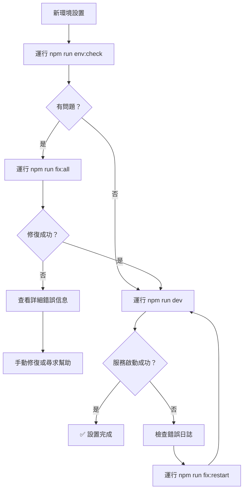

# 🚀 AI銷售賦能平台 - 新開發環境設置指南

> **完整的新開發者環境設置指南，確保在任何新電腦上都能快速、無錯誤地啟動項目**

## 📋 **快速開始（推薦）**

如果您遇到任何環境問題，直接使用我們的自動修復工具：

```bash
# 1. 克隆項目後，立即運行環境檢查
npm run env:check

# 2. 如果有問題，運行自動修復
npm run fix:all

# 3. 啟動開發服務器
npm run dev
```

## 📚 **詳細設置流程**

### **階段 1：系統要求檢查**

#### **1.1 基本要求**
- **Node.js**: v18.0.0 或更高版本 ✅
- **npm**: v8.0.0 或更高版本 ✅  
- **Git**: 任何版本 ✅
- **Docker Desktop**: 用於資料庫服務 ✅

#### **1.2 驗證安裝**
```bash
# 檢查版本
node --version    # 應該顯示 v18+ 或 v20+
npm --version     # 應該顯示 v8+
git --version     # 確認已安裝
docker --version  # 確認已安裝並運行
```

### **階段 2：項目克隆和初始化**

#### **2.1 克隆項目**
```bash
git clone <repository-url>
cd ai-sales-enablement-webapp-main
```

#### **2.2 環境檢查（重要！）**
在任何其他操作之前，先運行環境檢查：

```bash
npm run env:check
```

這個命令會檢查：
- ✅ Node.js 和 npm 版本
- ✅ 端口可用性（3000, 5433, 6379）
- ✅ Docker 服務狀態
- ✅ 環境變數文件
- ✅ 項目結構完整性

### **階段 3：環境配置**

#### **3.1 環境變數設置**
```bash
# 檢查和修復環境變數配置
npm run fix:env
```

這會自動：
- 檢查 `.env.local` 文件是否存在
- 修正資料庫連接配置
- 確保所有必要的環境變數都正確設置

#### **3.2 Docker 服務啟動**
```bash
# 啟動 PostgreSQL 和 Redis 容器
docker-compose -f docker-compose.dev.yml up -d

# 驗證容器運行狀態
docker ps
```

應該看到以下容器：
- `ai_sales_postgres` (端口 5433)
- `ai_sales_redis` (端口 6379)

### **階段 4：依賴安裝**

#### **4.1 清理安裝（推薦新環境）**
```bash
# 使用自動化工具安裝依賴
npm run fix:deps
```

這會自動：
- 清理任何現有的 `node_modules`
- 清理 `package-lock.json`
- 清理 npm 緩存
- 重新安裝所有依賴

#### **4.2 手動安裝（替代方案）**
```bash
# 如果自動化工具失敗，可以手動執行
rm -rf node_modules package-lock.json  # Linux/Mac
# 或
rmdir /s /q node_modules && del package-lock.json  # Windows

npm cache clean --force
npm install
```

### **階段 5：資料庫初始化**

#### **5.1 資料庫設置**
```bash
# 同步資料庫結構
npx prisma db push

# 創建測試用戶
npm run db:seed
```

#### **5.2 驗證資料庫連接**
```bash
# 檢查資料庫連接
npx prisma studio --browser none &
```

### **階段 6：啟動和測試**

#### **6.1 啟動開發服務器**
```bash
npm run dev
```

應該看到：
```
✓ Ready in 2-5s
- Local:        http://localhost:3000  (或 3001 如果 3000 被占用)
```

#### **6.2 測試關鍵功能**
1. **首頁測試**: 訪問 `http://localhost:3000`
2. **登錄測試**: 訪問 `http://localhost:3000/login`
   - 用戶名: `admin@example.com`
   - 密碼: `admin123`
3. **儀表板測試**: 登錄後訪問儀表板頁面

## 🚨 **常見問題和自動解決方案**

### **問題 1：依賴包缺失錯誤**
```
Module not found: Can't resolve '@radix-ui/react-checkbox'
```

**自動解決方案：**
```bash
npm run fix:deps
```

### **問題 2：資料庫連接錯誤**
```
Can't reach database server at localhost:5432
```

**自動解決方案：**
```bash
npm run fix:env
```

### **問題 3：端口被占用**
```
Port 3000 is in use, trying 3001 instead
```

**解決方案：** 這是正常的，Next.js 會自動使用端口 3001。

### **問題 4：Docker 容器未運行**
**自動檢查和修復：**
```bash
npm run fix:all
```

## 🛠️ **自動化工具命令參考**

### **環境檢查工具**
```bash
npm run env:setup        # 完整環境設置和檢查
npm run env:check        # 只檢查，不修復
npm run env:auto-fix     # 自動修復發現的問題
```

### **快速修復工具**
```bash
npm run fix:all          # 完整修復流程（推薦）
npm run fix:deps         # 只修復依賴問題
npm run fix:env          # 只修復環境變數
npm run fix:restart      # 重啟服務
npm run fix:diagnose     # 快速診斷問題
```

### **開發工具**
```bash
npm run dev              # 啟動開發服務器
npm run build            # 生產構建
npm run test             # 運行測試
npm run db:studio        # 打開資料庫管理界面
```

## 📊 **故障排除流程圖**



## 🎯 **最佳實踐**

### **新開發者設置檢查清單**
- [ ] 系統要求檢查完成
- [ ] 運行 `npm run env:check` 無錯誤
- [ ] Docker 容器正常運行
- [ ] 環境變數配置正確
- [ ] 依賴包完整安裝
- [ ] 資料庫連接測試通過
- [ ] 開發服務器啟動成功
- [ ] 登錄功能測試通過
- [ ] 儀表板頁面訪問正常

### **日常開發建議**
- 每次拉取最新代碼後運行 `npm run fix:diagnose`
- 遇到奇怪錯誤時先運行 `npm run fix:all`
- 定期清理和重新安裝依賴（每週一次）
- 保持 Docker Desktop 運行

## 🆘 **尋求幫助**

如果自動化工具無法解決問題：

1. **收集信息**：
   ```bash
   npm run fix:diagnose > diagnosis.log
   npm run env:check > environment.log
   ```

2. **查看詳細錯誤**：
   - 檢查控制台錯誤信息
   - 查看 Docker 容器日誌：`docker logs ai_sales_postgres`
   - 檢查 Next.js 開發服務器日誌

3. **常見解決方案**：
   - 重啟 Docker Desktop
   - 檢查防火牆設置
   - 確認網路連接
   - 清理系統緩存

## 📝 **版本記錄**

| 版本 | 日期 | 更改 | 作者 |
|------|------|------|------|
| 1.0  | 2025-09-29 | 初始版本，包含自動化工具 | AI Assistant |

---

**💡 提示**: 這個指南的目標是讓任何開發者在 15 分鐘內完成環境設置。如果您發現任何問題或有改進建議，請更新這個文檔。
