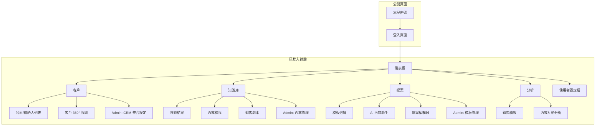

# UI/UX 規格文件 - 客製化銷售智能體

**版本**: 2.0 (完整詳細版)
**日期**: 2024-01-09
**作者**: Sally (UX Expert)

---

## 1. 介紹 (Introduction)

本文件定義了「客製化銷售智能體」使用者介面的體驗目標、資訊架構、使用者流程和視覺設計規格。它將作為視覺設計和前端開發的基礎，確保提供一個有凝聚力且以使用者為中心的體驗。

### 1.1 整體 UX 目標與原則

#### 目標使用者畫像 (Target User Personas)

1. **銷售代表 (Primary User)**
   - 需要快速存取客戶資訊和產品知識
   - 時間緊迫，經常在移動中工作
   - 期望簡潔、高效的操作流程

2. **銷售經理 (Secondary User)**
   - 需要監控團隊績效和活動
   - 重視數據視覺化和洞察
   - 需要客製化報表功能

3. **系統管理員 (Admin User)**
   - 負責知識庫維護和用戶管理
   - 需要強大的後台管理功能
   - 重視系統穩定性和安全性

#### 可用性目標 (Usability Goals)

1. **學習容易度**: 新用戶能在 10 分鐘內完成首次搜尋和客戶資料查看
2. **使用效率**: 熟練用戶可在 30 秒內找到所需的產品知識或客戶資訊
3. **錯誤預防**: 所有關鍵操作都有確認機制，防止意外刪除或修改
4. **記憶性**: 界面設計直觀，用戶隔週使用仍能快速上手
5. **滿意度**: 提供即時回饋，讓用戶清楚知道系統狀態

#### 設計原則 (Design Principles)

1. **簡潔優先（Simplicity First）** - 避免功能堆疊，專注核心銷售場景
2. **即時回應（Instant Response）** - AI 搜尋結果即時顯示，減少等待時間
3. **情境感知（Context-Aware）** - 根據用戶當前任務智能推薦相關資訊
4. **移動優先（Mobile-First）** - 優先考慮手機使用場景，支援離線模式
5. **資料驅動（Data-Driven）** - 透過視覺化幫助用戶快速理解複雜數據

**重要更正**: 基於您的回饋，我們將採用**桌面優先 (Desktop-First)** 策略，因為主要使用場景是筆記型電腦。

### 1.2 類似產品的 UX 模式分析

在 AI 銷售賦能領域，領先的產品如 **Seismic**, **Highspot**, **Gong.io**, 和 **Salesforce Einstein** 等，它們的 UX 設計普遍呈現出以下幾種成熟的模式：

#### 1. 儀表板為中心的首頁 (Dashboard-centric Home)
- **模式**: 用戶登入後看到的第一個畫面通常是一個個人化的儀表板
- **內容**: 顯示關鍵績效指標（KPIs）、即將到來的會議、智慧提醒、以及最近活動的摘要
- **為何有效**: 為銷售代表和經理提供了一個快速的每日概覽，讓他們能立即掌握最重要的資訊

#### 2. 全局智能搜尋列 (Global Smart Search Bar)
- **模式**: 螢幕頂部或側邊欄總是有一個強大的搜尋框
- **內容**: 支援自然語言查詢（例如，「給我看上週和 Acme 公司有關的技術文件」）
- **為何有效**: 銷售人員最核心的需求是「快速找到資訊」

#### 3. 情境化資訊推薦 (Contextual Information Delivery)
- **模式**: 在用戶查看特定內容時，系統會自動在側邊欄或卡片中推薦相關的資訊
- **為何有效**: 這就是 AI 賦能的體現，將「人找資訊」變成了「資訊找人」

#### 4. 銷售劇本/內容中心 (Playbooks / Content Hub)
- **模式**: 一個結構化的知識庫，圍繞銷售場景組織的「劇本」
- **為何有效**: 它將最佳實踐結構化，幫助新進銷售人員快速成長

#### 5. 360 度客戶視圖 (360-Degree Customer View)
- **模式**: 整合來自多個來源的資訊，在一個統一的介面中呈現
- **為何有效**: 避免了銷售人員在多個系統之間來回切換的麻煩

#### 6. AI 內容生成工作流程 (AI Generation Workflow)
- **模式**: 通常是一個引導式的彈出視窗或多步驟的表單
- **為何有效**: 大幅縮短了撰寫重複性內容的時間

### 1.3 AI 功能對 UX 的特殊要求分析

為 AI 功能設計 UX，我們需要超越傳統的介面設計，更專注於**信任、透明度、控制權**和**回饋循環**。

#### 1. 建立信任：讓 AI 不再是「黑盒子」
- **可解釋性 (Explainability)**: 當 AI 推薦一份文件或一個銷售策略時，需要用簡潔的語言解釋「為什麼」
- **顯示信賴度分數 (Confidence Scores)**: 對於 AI 的預測或分類，可以顯示一個信賴度百分比
- **展示資料來源 (Surface Data Sources)**: 簡要說明 AI 的結論是基於哪些資料來源

#### 2. 提供使用者控制權：人機協作而非取代
- **可操作的建議 (Actionable Suggestions)**: AI 的建議不應該是最終命令
- **允許微調參數 (Allow Fine-tuning)**: 提供「進階設定」或「調整偏好」的選項
- **清晰的撤銷/還原 (Easy Undo/Override)**: 使用者必須能夠輕易地拒絕 AI 的建議

#### 3. 設計有效的回饋循環：讓 AI 持續進化
- **低摩擦的回饋機制**: 在 AI 推薦的內容旁邊，提供簡單的「讚/倒讚」👍👎 按鈕
- **隱性回饋的捕捉**: 系統應能捕捉隱性的使用者行為作為回饋
- **展示學習進度**: 適時地告訴使用者，AI 因為他們的互動而變得更聰明

#### 4. 處理不確定性與錯誤：優雅地失敗
- **承認不確定性**: 當 AI 信賴度不高時，它應該坦誠地告訴使用者
- **提供替代方案**: 當 AI 無法完成任務時，系統應優雅地降級
- **清晰的錯誤邊界**: 讓使用者清楚地知道哪些是 AI 的錯誤

---

## 2. 資訊架構 (Information Architecture - IA)

### 2.1 搜尋功能在 IA 中的核心地位

對於這個 AI 銷售賦能平台而言，搜尋功能**不是一個輔助工具，它本身就是核心的使用者介面 (The Search is the UI)**。

#### 它是銷售人員最自然的互動模式
- 銷售人員的心智模型是「目標導向」而非「探索導向」
- 他們會直接「提問」：「Acme 公司的主要痛點是什麼？」
- 一個強大的、無處不在的搜尋框，就是他們進入知識宇宙的「任意門」

#### 它是 AI 價值的最主要體現
- 傳統搜尋是「大海撈針」，使用者輸入關鍵字，系統回傳一堆連結
- 我們的 AI 搜尋應該是「私人研究助理」，能：
  - **理解意圖**: 透過自然語言處理理解使用者問題的真實意圖
  - **綜合答案**: 從多份文件中提取、總結，直接生成簡潔的答案
  - **提供情境**: 搜尋結果需要與使用者的當前情境動態關聯

#### 它是串連所有資訊孤島的唯一線索
- 搜尋功能是唯一能夠跨越界線，提供統一、無縫體驗的層級

#### 搜尋功能在 IA 中的三種形態
1. **全局搜尋 (Global Search)**: 永遠可見的「大腦入口」
2. **範圍化搜尋 (Scoped Search)**: 在特定頁面進行的深度挖掘
3. **主動式搜尋 (Proactive/Invisible Search)**: AI 預測需求並主動呈現結果

### 2.2 網站地圖 / 畫面清單



### 2.3 主導航項目優先級與順序檢視

原本規劃的順序：Dashboard → Knowledge Base → Customers → Proposals → Analytics

**調整後的建議順序**：Dashboard → Customers → Knowledge Base → Proposals → Analytics

**理由**：
- 銷售工作流程：概覽 → 目標 → 行動 → 產出 → 回顧
- 將"客戶"放在"知識庫"之前，更符合"先確定目標，再尋找武器"的邏輯
- 幾乎所有的銷售活動都是圍繞著客戶展開的

### 2.4 情境化 AI 推薦融入策略

#### 儀表板 - 「你今天應該關注什麼」
- **推薦模組**: 「智慧焦點」或「今日建議」的動態卡片區域
- **推薦內容**:
  - 會議相關：即將開始的會議準備資料
  - 銷售機會相關：需要跟進的機會提醒
  - 新內容提醒：相關的新上傳內容

#### 客戶 360° 視圖 - 「針對這位客戶，你應該了解這些」
- **推薦模組**: 頁面右側的「AI 洞察」側邊欄
- **推薦內容**:
  - 最相關內容：自動搜尋與該客戶匹配的文件
  - 相似客戶分析：類似客戶的成功案例
  - 下一步建議：基於互動歷史的行動建議

#### 知識庫 - 「正在找這個嗎？也許你也需要……」
- **推薦模組**: 內容頁面的側邊欄「相關內容」
- **推薦內容**:
  - 直接相關：同產品的其他文件
  - 關聯使用：常一起使用的內容
  - 使用者行為關聯：其他人還看過的內容

#### 提案生成器 - 「讓你的提案更具說服力」
- **推薦模組**: 編輯器側邊欄的「內容助手」
- **推薦內容**:
  - 個性化片段：根據客戶特徵推薦的內容
  - 相關證據：ROI 計算器、客戶見證
  - 圖片/圖表建議：視覺化內容推薦

---

## 3. 使用者流程 (User Flows)

### 流程：查找並使用銷售內容

**使用者目標**: 銷售代表需要在拜訪客戶前，快速找到與客戶行業和痛點相關的產品規格書和成功案例，並將其分享給客戶。

**進入點**:
- Dashboard 的全局搜尋框
- 主導覽列的 "Knowledge Base" 連結
- 在 Customer 360° 頁面中，由 AI 推薦的相關內容連結

**成功標準**:
- 使用者在 60 秒內找到至少一份高度相關的文件
- 使用者能成功將文件透過郵件或連結分享出去
- 系統能記錄這次的分享活動

```mermaid
graph TD
    A[開始] --> B{如何開始搜尋?};
    B -->|選項 1: 全局搜尋| C[在搜尋框輸入 "金融科技安全案例"];
    B -->|選項 2: 瀏覽| D[點擊 '知識庫'];
    B -->|選項 3: AI 推薦| E[在 "ABC 公司" 客戶頁面，點擊 AI 建議的內容];

    D --> F[按 '案例研究' 和 '金融科技' 篩選];
    
    C --> G[搜尋結果頁];
    F --> G;
    E --> H[內容檢視頁];

    G --> G1{結果相關嗎?};
    G1 -->|是| H;
    G1 -->|否| G2[優化搜尋詞或篩選器];
    G2 --> G;

    H --> I{如何處理內容?};
    I -->|選項 A: 分享| J[點擊 '分享' 按鈕];
    I -->|選項 B: 儲存| K[點擊 '加入我的最愛'];
    I -->|選項 C: 用於提案| L[點擊 '加入提案'];

    J --> M[選擇分享方式 (郵件/連結)];
    J --> N[系統記錄分享活動];
    M --> O[結束];
    K --> O;
    L --> P[重定向到提案生成器];
    P --> O;
```

**邊界與錯誤處理**:
- **搜尋無結果**: 提供智慧建議，如「找不到完全匹配的結果，但我們找到了關於 '金融業安全' 的熱門文件」
- **內容權限**: 如果使用者嘗試存取無權限的文件，顯示清晰的提示訊息
- **分享失敗**: 提供即時、清晰的錯誤回饋，並建議使用者重試

---

## 4. 線框圖與視覺稿 (Wireframes & Mockups)

### 設計檔案
- **主要設計檔案**: `[待創建的 Figma 專案連結]`

### 關鍵頁面佈局概念（桌面優先）

#### 1. Dashboard（儀表板）
- **用途**: 為使用者提供每日工作的快速概覽和智慧起點
- **佈局**: 採用經典的「三欄式」佈局
  - **左側邊欄**: 固定的主導覽欄
  - **主內容區**: 卡片式設計，包含：
    - 頂部：非常顯眼的全局智能搜尋框
    - 今日會議卡片
    - 智慧焦點卡片（AI 推薦）
    - 最近活動卡片
  - **右側邊欄**: 團隊動態更新、通知

#### 2. Customer 360° View（客戶詳情頁）
- **用途**: 整合展示關於單個客戶的所有信息
- **佈局**: 「兩欄式」佈局
  - **左側主內容區 (70% 寬度)**:
    - 客戶基本信息
    - 標籤頁設計：概覽、聯絡人、銷售機會、互動歷史、相關文件
  - **右側 AI 側邊欄 (30% 寬度)**:
    - 標題：「AI 洞察」
    - 建議行動、推薦內容、相似客戶分析

#### 3. Search Results Page（搜尋結果頁）
- **用途**: 呈現強大、清晰、可操作的 AI 搜尋結果
- **佈局**: 「篩選+列表」佈局
  - **左側篩選欄**: 內容類型、創建日期、相關產品等篩選器
  - **右側結果列表**:
    - 頂部：AI 生成的直接答案或摘要
    - 結構化的結果列表，每個項目包含：
      - 標題、文件類型圖標、摘要
      - AI 推薦理由
      - 快速操作按鈕

### Figma 原型卡片概念設計 (Content Card)

#### 視覺元素拆解

**1. 容器 (Container)**
- **尺寸**: 寬度自適應，高度由內容決定
- **背景色**: `#FFFFFF` (白色)
- **內距**: `24px` (遵循 8px 網格)
- **邊框**: `1px solid #DFE1E6`
- **圓角**: `8px`
- **陰影**: 
  - 預設: 無
  - 懸浮: `box-shadow: 0px 4px 8px rgba(0, 0, 0, 0.1);`

**2. 圖示與標題區**
- **圖示**: Material Icons - `description` (文件圖示)
- **顏色**: `#0052CC` (主色)
- **大小**: 24x24px
- **標題**: Inter, `20px` (H3), `Semi-bold`，`#172B4D`

**3. 元數據**
- **範例**: "Case Study | Published: 2024-09-20"
- **字體**: Inter, `14px`, `Regular`，`#5E6C84`

**4. 描述摘要**
- **字體**: Inter, `16px`, `Regular`，`#5E6C84`
- **行高**: `24px`
- **截斷**: 最多顯示 3 行

**5. AI 洞察區**
- **背景色**: `#FFF4E5` (淺黃色)
- **邊框**: `1px solid #FFAB00`
- **圖示**: 燈泡或魔法棒，`#FFAB00`
- **文字**: "✨ Recommended for your 'Project Titan' opportunity."

**6. 操作區**
- **按鈕 1**: Primary 按鈕 - "View Details"
- **按鈕 2**: Secondary 按鈕 - "Share"

---

## 5. 元件庫 / 設計系統 (Component Library / Design System)

### 設計系統方法

**採用一個成熟的開源 UI 元件庫作為基礎，並在其之上進行客製化，以符合我們的品牌風格。**

**推薦選項**:
1. **Material-UI (MUI)**: Google 的 Material Design 實現
2. **Ant Design**: 企業級的 UI 設計語言
3. **Headless UI + Tailwind CSS**: 最高度的客製化

**建議**: 考慮到企業性質和數據展示需求，**Tailwind CSS + Headless UI** 是最佳選擇。

### 核心元件

1. **Button (按鈕)**
   - 變體: Primary, Secondary, Text/Link, Icon Button
   - 狀態: default, hover, focused, disabled, loading

2. **Card (卡片)**
   - 變體: Stat Card, Content Card, Action Card
   - 狀態: default, hover

3. **Input & Search Bar**
   - 變體: Global Search Bar, Standard Input, Textarea
   - 狀態: default, focus, error, disabled

4. **Tabs (標籤頁)**
5. **Navigation (導覽)**
6. **Modal (彈出式視窗)**

---

## 6. 品牌與樣式指南 (Branding & Style Guide)

### 色彩搭配 (Color Palette)

| 顏色類型 | Hex 色碼 | 用途說明 |
|---------|---------|---------|
| 主色 (Primary) | `#0052CC` | 用於主要按鈕、活動連結、導覽列選中狀態 |
| 輔色 (Secondary) | `#4A4A4A` | 用於次要按鈕、邊框和次要文字 |
| 強調色 (Accent) | `#FFAB00` | 用於 AI 建議、新功能提示等需要特別注意的地方 |
| 成功色 (Success) | `#36B37E` | 用於操作成功、驗證通過等正面回饋 |
| 警告色 (Warning) | `#FFC400` | 用於需要使用者注意的提示 |
| 錯誤色 (Error) | `#DE350B` | 用於錯誤訊息、刪除確認等警示性操作 |
| 中性色 | 多種灰階 | 構成介面的基礎，用於背景、文字和區塊 |

### 字體排印 (Typography)

- **字體家族**: Inter 或 Lato (無襯線字體)
- **字體層級**:
  | 元素 | 字體大小 | 字重 | 行高 |
  |-----|---------|------|------|
  | H1 | 32px | Bold | 1.2 |
  | H2 | 24px | Bold | 1.3 |
  | H3 | 20px | Semi-bold | 1.4 |
  | Body | 16px | Regular | 1.5 |
  | Small | 14px | Regular | 1.5 |

### 圖示系統選擇

**選擇: Material Symbols**

理由：
- 巨量圖標庫（近 3000 個圖標）
- 風格現代且高度一致
- 支援字體圖標和 SVG 兩種格式
- 可變字重調節，非常靈活

**核心功能圖標**:
| 導航項目 | 推薦圖標 | 圖標名稱 |
|---------|---------|----------|
| Dashboard | ▓ | `space_dashboard` |
| Customers | 👥 | `groups` |
| Knowledge Base | 📖 | `auto_stories` |
| Proposals | 📝 | `request_quote` |
| Analytics | 📈 | `monitoring` |

### 樣式指南程式碼化策略

#### 方案一：使用原生 CSS 變數
```css
:root {
  /* Color Palette */
  --color-primary: #0052CC;
  --color-secondary: #4A4A4A;
  --color-accent: #FFAB00;
  
  /* Typography */
  --font-family-primary: 'Inter', sans-serif;
  --font-size-h1: 32px;
  
  /* Spacing (8px Grid System) */
  --space-1: 8px;
  --space-2: 16px;
  --space-3: 24px;
}
```

#### 方案二：使用 Tailwind CSS 配置（推薦）
```javascript
module.exports = {
  theme: {
    extend: {
      colors: {
        primary: '#0052CC',
        secondary: '#4A4A4A',
        accent: '#FFAB00',
      },
      fontFamily: {
        sans: ['Inter', 'sans-serif'],
      },
    },
  },
};
```

### 品牌元素在數據視覺化中的應用策略

#### 顏色的策略性使用
- **主色 (`#0052CC`)**: 用於表示核心、正向或當前的數據系列
- **輔色 (`#4A4A4A`)**: 用於表示對比、基準或歷史數據
- **強調色 (`#FFAB00`)**: 高亮顯示圖表中最需要用戶關注的洞察或異常點
- **語義化顏色**: 成功色、警告色、錯誤色用於表示達成目標、接近閾值、未達標等狀態

#### 字體的清晰應用
- **圖表標題**: 使用 H3 樣式 (20px, Semi-bold)
- **坐標軸標籤/圖例**: 使用小型文字樣式 (14px, Regular)
- **數據標籤**: 使用正文樣式 (16px)

#### 互動與動畫
- **懸浮效果**: 數據點懸浮時用主色或強調色高亮
- **加載動畫**: 圖表應有優雅的加載動畫
- **過濾動畫**: 數據更新時有平滑的過渡效果

---

## 7. 無障礙需求 (Accessibility Requirements)

### 合規目標
**標準**: Web Content Accessibility Guidelines (WCAG) 2.1 AA 級別

### 關鍵需求

#### 視覺方面
- **色彩對比度**: 所有文字與背景的對比度至少為 4.5:1
- **焦點指示器**: 所有可互動元素必須有清晰可見的視覺外框
- **非色彩依賴**: 禁止單獨使用顏色來傳達重要資訊

#### 互動方面
- **鍵盤導覽**: 所有功能都必須可以僅使用鍵盤來操作
- **螢幕閱讀器支援**: 使用語義化的 HTML 和 ARIA 屬性
- **觸控目標**: 在移動端，所有可點擊目標至少為 44x44px

#### 內容方面
- **標題結構**: 使用正確的標題層級組織內容
- **表單標籤**: 每個表單輸入元件都必須有關聯的 label

### 測試策略
- **自動化測試**: 整合 Axe 或 Lighthouse
- **手動測試**: 定期進行鍵盤和螢幕閱讀器測試
- **使用者測試**: 邀請有障礙的使用者參與測試

---

## 8. 響應式設計策略 (Responsiveness Strategy)

### 修正後的策略：桌面優先 (Desktop-First)

基於您的回饋，我們採用**桌面優先**的設計方法，因為主要使用場景是筆記型電腦。

### 斷點定義

| 斷點名稱 | 最小寬度 | 目標設備 | 佈局策略 |
|---------|---------|---------|---------|
| Wide (寬屏) | 1440px | 大型顯示器 | 增強型三欄佈局，增加留白 |
| Desktop (桌面) | 1024px | 筆記型電腦 | 核心體驗，完整的三欄佈局 |
| Tablet (平板) | 768px | 平板電腦 | 簡化為兩欄，側邊欄可能收起 |
| Mobile (手機) | 320px | 智慧型手機 | 單欄佈局，垂直堆疊 |

### 適應模式

#### 佈局變化
- **桌面**: 完整的三欄佈局，所有功能完全展示
- **平板**: 主導航可能收起，內容區開始分欄
- **手機**: 嚴格的單欄垂直滾動

#### 導航變化
- **桌面**: 主導航作為固定的左側邊欄一直顯示
- **手機/平板**: 主導航隱藏在漢堡菜單後面

#### 內容優先級
- **桌面**: 同時展示主要內容和次要資訊
- **手機**: 優先顯示核心內容，次要信息可能被隱藏

---

## 9. 動畫與微交互 (Animation & Micro-interactions)

### 動畫原則
**動畫應該服務於功能，而非單純為了炫技。**

### 過渡動畫 (Transitions)

#### 頁面切換
- **策略**: 使用輕微的淡入淡出效果
- **持續時間**: 約 200ms，使用 ease-out 緩動函數

#### 組件加載
- **策略**: 使用骨架屏 (Skeleton Screens)
- **理由**: 比旋轉的加載圖標更能管理用戶期望

#### 展開/折疊
- **策略**: 平滑的高度變化
- **持續時間**: 約 250ms，使用 ease-in-out

### 微交互 (Micro-interactions)

#### 按鈕點擊
- **策略**: 輕微的向下位移和縮小效果
- **理由**: 提供物理感的反饋

#### 懸浮效果
- **策略**: 平滑的陰影提升或顏色變化
- **過渡時間**: 150ms

### AI 思考動畫視覺概念設計

#### 概念一：「神經元脈衝」(Neural Pulse)
**視覺元素**:
- 基礎：強調色 (`#FFAB00`) 構成的簡約圖標
- 動畫：
  1. 圖標保持靜止或輕微呼吸式縮放
  2. 周期性向外擴散柔和的光暈
  3. 幾顆光點沿預設路徑快速移動
- 搭配文字：動態變化的狀態文字

#### 概念二：「動態查詢」(Dynamic Query)
**視覺元素**:
- 在觸發按鈕下方或旁邊出現文字區域
- 文字序列示例：
  1. 正在分析客戶需求...
  2. 正在搜尋知識庫...
  3. 正在組織提案架構...
  4. 即將完成...

### 具體應用場景：按鈕中的 AI 思考動畫

**互動流程**:
1. **初始狀態**: Primary 按鈕，文字為"生成提案草稿"
2. **點擊後**:
   - 文字變為"正在生成..."
   - 背景出現微光掃過效果 (shimmer effect)
   - 圖標發出呼吸式脈衝光暈
3. **完成後**: 恢復初始狀態

**混合使用策略**:
- 短時任務 (< 2秒): 使用按鈕內的脈衝動畫
- 長時任務 (> 2秒): 使用動態查詢文字動畫

---

## 10. 效能考量 (Performance Considerations)

### 效能目標

基於 Google 的 RAIL 模型和核心 Web 指標：

- **首次內容繪製 (FCP)**: < 1.8 秒
- **最大內容繪製 (LCP)**: < 2.5 秒
- **首次輸入延遲 (FID)**: < 100 毫秒
- **動畫流暢度**: 維持 60 FPS

### 影響效能的設計策略

#### 優化圖片資源
- **格式選擇**: 優先使用 WebP 或 AVIF
- **懶加載**: 非首屏圖片採用懶加載
- **響應式圖片**: 根據設備提供不同尺寸

#### 管理字體載入
- **預載入**: 使用 `<link rel="preload">`
- **顯示策略**: 使用 `font-display: swap;`

#### 減少渲染阻塞
- 避免在頁面頭部放置過多 CSS 或同步 JavaScript

#### 數據分頁與虛擬化
- **分頁**: 採用分頁或無限滾動機制
- **虛擬化**: 對超長列表使用列表虛擬化技術

---

## 11. 下一步行動

### 立即行動
1. 與利益相關者審查此文檔
2. 在 Figma 中創建視覺設計稿
3. 準備移交給架構師進行技術架構設計
4. 確定任何未決的設計決策

### 設計交付檢查清單
- ✓ 所有用戶流程已記錄
- ✓ 元件庫完整定義
- ✓ 無障礙需求明確
- ✓ 響應式策略清晰
- ✓ 品牌指南已整合
- ✓ 效能目標已設定

---

*文檔結束*
