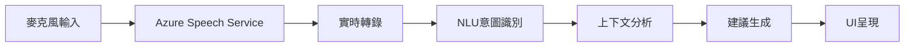

# 🚀 未來創新功能路線圖

> **文檔目的**: 記錄創新功能想法和技術探索方向，為未來迭代提供參考
> **狀態**: 📋 **規劃中** - 待MVP Phase 2完成後評估
> **最後更新**: 2025-09-30
> **來源**: MVP Phase 2規劃會議 - 選項B創新驅動路線

---

## 📖 文檔背景

在MVP Phase 2規劃過程中，我們識別了三個可能的發展方向：
- **選項A**: 標準MVP Phase 2路線（已採用）
- **選項B**: 創新驅動路線（本文檔記錄的內容）⭐
- **選項C**: 穩健優化路線（部分已整合到選項A）

**最終決策**: 採用 **A+C混合方案**，但保留選項B的創新想法供未來參考。

本文檔詳細記錄選項B中的創新功能，當市場條件成熟、技術資源充足或競爭需要時，可以啟動這些功能的開發。

---

## 🎯 創新功能概覽

### 核心創新理念
將AI銷售賦能平台從 **輔助工具** 升級為 **實時智能夥伴**，通過語音AI和實時分析技術，在銷售會議中提供即時支援和洞察。

### 四大創新功能模組

1. 🎤 **實時語音助理** - 會議中的AI助理
2. 📝 **智能語音轉文字** - 自動化會議記錄
3. 💭 **AI情感分析** - 客戶情緒識別
4. 💡 **智能對話推薦** - 實時談話要點建議

---

## 🎤 創新功能 1: 實時語音助理

### 功能概述
在銷售會議進行中，提供實時的AI建議、資料查詢和決策支援，就像有一個隱形的資深顧問在旁協助。

### 核心能力

#### 1. **會議中實時建議**
```yaml
場景: 銷售會議進行中
觸發: 語音關鍵詞識別

功能:
  - 客戶提到競品 → 即時推送我方優勢對比
  - 討論定價 → 顯示建議報價和折扣範圍
  - 技術問題 → 快速檢索知識庫答案
  - 異議處理 → 提供標準應對話術
```

#### 2. **語音命令系統**
```typescript
// 語音命令示例
"查找客戶歷史訂單"     → 自動檢索CRM數據
"顯示產品A的案例研究"   → 快速展示相關案例
"發送提案範本給團隊"    → 自動分享文檔
"記錄跟進事項"         → 創建任務提醒
```

#### 3. **智能上下文理解**
- 理解會議主題和階段
- 追蹤談話關鍵點
- 識別客戶關注領域
- 預測下一步需求

### 技術架構

#### 語音處理流程


#### 核心技術棧
```yaml
語音識別:
  - Azure Speech-to-Text (實時轉錄)
  - 支援多語言: 中文、英文、馬來語
  - 噪音消除和說話人分離

自然語言理解:
  - Azure Language Service
  - 意圖識別和實體提取
  - 上下文追蹤

建議引擎:
  - GPT-4 實時分析
  - 知識庫快速檢索
  - CRM數據即時查詢

前端展示:
  - WebSocket 實時通信
  - React 低延遲UI
  - 移動設備優化
```

### 用戶介面設計

#### 桌面版介面
```
┌─────────────────────────────────────┐
│  🎤 實時語音助理 - 會議中           │
├─────────────────────────────────────┤
│  客戶: "你們的產品和XX比有什麼優勢?" │
│                                     │
│  💡 AI建議:                         │
│  ✓ 我方在AI準確度上領先15%          │
│  ✓ 整合成本降低40%                  │
│  ✓ 本地支援團隊響應更快             │
│                                     │
│  📊 相關資料:                        │
│  • 對比報告.pdf                     │
│  • 客戶成功案例 (相似行業)           │
│                                     │
│  [查看詳情] [發送到客戶]             │
└─────────────────────────────────────┘
```

#### 移動版介面
- 極簡設計，只顯示關鍵建議
- 振動提醒重要建議
- 快速操作按鈕

### 使用場景

#### 場景1: 價格談判
```yaml
情境: 客戶詢問價格折扣
AI檢測: 關鍵詞 "價格", "折扣", "預算"

AI行動:
  1. 顯示建議報價範圍
  2. 提示該客戶的預算記錄
  3. 推薦類似規模客戶的成交價
  4. 提供價值包裝建議
```

#### 場景2: 技術疑問
```yaml
情境: 客戶詢問技術細節
AI檢測: 專業術語和疑問語氣

AI行動:
  1. 檢索知識庫相關文章
  2. 顯示技術規格文檔
  3. 推薦技術演示視頻
  4. 建議安排技術專家跟進
```

#### 場景3: 競品比較
```yaml
情境: 客戶提到競爭對手
AI檢測: 競品名稱、"比較"等關鍵詞

AI行動:
  1. 顯示競品對比矩陣
  2. 突出我方差異化優勢
  3. 提供成功轉換案例
  4. 警示競品常見異議
```

### 開發規劃

#### Phase 1: 基礎功能 (6-8週)
- [P1] 語音轉文字實時轉錄
- [P1] 關鍵詞觸發建議系統
- [P1] 基礎UI界面
- [P2] 知識庫快速檢索整合

#### Phase 2: 智能化 (4-6週)
- [P1] 上下文理解和意圖識別
- [P1] GPT-4驅動的建議生成
- [P2] 說話人分離
- [P2] 移動端優化

#### Phase 3: 增強功能 (4-6週)
- [P2] 多語言支持
- [P2] 離線模式
- [P3] 自定義命令
- [P3] 團隊協作功能

### 成本估算

#### 開發成本
- 開發團隊: 2-3人 × 14-20週
- 專業語音AI工程師: 必需
- 預估人工: 約30-40人週

#### 運營成本（月度）
```yaml
Azure服務:
  - Speech-to-Text API: $100-300（基於使用量）
  - Language Service: $50-100
  - GPT-4 API額外調用: $200-400
  - WebSocket服務: $50-100

總計: $400-900/月（基於100-500活躍用戶）
```

### 技術風險

#### 高風險 🔴
1. **實時性能挑戰**
   - 語音識別延遲: 需<2秒
   - 建議生成速度: 需<3秒
   - 總延遲目標: <5秒

2. **語音識別準確率**
   - 不同口音和語速
   - 環境噪音干擾
   - 專業術語識別

#### 中風險 🟡
3. **用戶隱私顧慮**
   - 會議錄音和隱私
   - 資料存儲合規性
   - 客戶同意機制

4. **使用習慣培養**
   - 用戶接受度
   - 操作複雜度
   - 培訓成本

### 成功指標

#### 技術指標
- 語音識別準確率: >90%
- 建議生成延遲: <5秒
- 系統穩定性: >99%

#### 業務指標
- 功能採用率: >60%（初期）
- 建議採納率: >40%
- 會議效率提升: >30%
- 用戶滿意度: >80%

---

## 📝 創新功能 2: 智能語音轉文字

### 功能概述
自動將銷售會議錄音轉換為結構化文字記錄，包含關鍵決策點、行動項目和後續跟進事項。

### 核心能力

#### 1. **高準確度轉錄**
```yaml
基礎功能:
  - 實時或離線轉錄
  - 說話人分離和標註
  - 標點符號智能添加
  - 專業術語優化

高級功能:
  - 多語言自動檢測和混合
  - 口語化轉書面化
  - 填充詞過濾
  - 重複內容去重
```

#### 2. **智能摘要生成**
```typescript
// 會議記錄結構化輸出
interface MeetingTranscript {
  metadata: {
    date: string;
    attendees: string[];
    duration: number;
    topics: string[];
  };

  summary: {
    executiveSummary: string;      // 執行摘要
    keyPoints: string[];            // 關鍵要點
    decisions: Decision[];          // 決策記錄
    actionItems: ActionItem[];      // 行動項目
    concerns: string[];             // 客戶顧慮
  };

  fullTranscript: {
    segments: TranscriptSegment[];  // 完整轉錄
    timeline: TimelineEvent[];      // 時間線
  };
}
```

#### 3. **自動化跟進**
- 行動項目自動創建任務
- 會議記錄自動發送
- 關鍵決策點標記
- 風險點識別和提醒

### 技術實施

#### 轉錄處理流程
```yaml
第1階段: 語音處理
  - 錄音上傳或實時流
  - 音頻預處理（降噪）
  - Azure Speech Service轉錄

第2階段: 文本優化
  - 標點符號添加
  - 說話人標註
  - 專業術語校正
  - 口語轉書面語

第3階段: AI分析
  - GPT-4生成摘要
  - 關鍵點提取
  - 情感分析
  - 行動項目識別

第4階段: 結構化輸出
  - 格式化文檔生成
  - CRM數據同步
  - 任務系統整合
  - 郵件通知發送
```

#### 說話人分離技術
```python
# 使用Azure Speech Diarization
from azure.cognitiveservices.speech import SpeechConfig, AudioConfig
from azure.cognitiveservices.speech.transcription import ConversationTranscriber

# 配置說話人分離
speech_config = SpeechConfig(subscription=key, region=region)
audio_config = AudioConfig(filename="meeting.wav")

# 創建轉錄器
transcriber = ConversationTranscriber(speech_config, audio_config)

# 識別不同說話人
# 輸出: "說話人1: ...", "說話人2: ..."
```

### 輸出格式示例

#### 會議記錄文檔
```markdown
# 銷售會議記錄 - ABC公司

**日期**: 2025-10-15 14:00-15:30
**參與者**: 張經理（ABC）、李顧問（ABC）、王銷售、陳工程師
**主題**: 產品演示和需求討論

## 📋 執行摘要
ABC公司對我方AI銷售平台表示強烈興趣，特別關注與現有Dynamics 365的整合能力...

## 🎯 關鍵決策
1. ✅ **確定POC試用**: 2週試用期，10個用戶
2. ⏳ **技術對接安排**: 10月20日安排技術會議
3. ⏳ **報價提供**: 10月18日前提供正式報價

## 📝 行動項目
- [ ] 王銷售：10月18日前發送正式報價 (高優先級)
- [ ] 陳工程師：準備Dynamics 365整合技術文檔
- [ ] 張經理（ABC）：內部確認POC用戶名單
- [ ] 李顧問（ABC）：IT部門確認環境準備

## 💬 客戶關注點
- Dynamics 365整合的複雜度和時間
- 資料安全和合規性
- 中文支援的完整度
- 本地技術支援能力

## ⚠️ 風險點
- 決策週期可能較長（需董事會批准）
- 預算審批在Q1進行
- 競品X公司也在洽談中

## 📄 完整記錄
[展開查看完整轉錄內容...]
```

### 使用場景

#### 場景1: 內部團隊協作
- 無法參加會議的團隊成員快速了解情況
- 新人學習優秀銷售的溝通技巧
- 管理層審查銷售過程

#### 場景2: 合規和審計
- 重要承諾和協議記錄
- 糾紛時的證據材料
- 銷售流程質量審核

#### 場景3: 知識管理
- 成功案例提取和分享
- 常見異議和應對方式
- 最佳實踐識別

### 開發規劃

#### Phase 1: 基礎轉錄 (4週)
- [P1] 錄音上傳和轉錄
- [P1] 基礎文本輸出
- [P2] 說話人分離

#### Phase 2: 智能分析 (4週)
- [P1] AI摘要生成
- [P1] 關鍵點提取
- [P1] 行動項目識別

#### Phase 3: 系統整合 (4週)
- [P1] CRM同步
- [P1] 任務系統整合
- [P2] 郵件自動發送

### 成本估算
```yaml
開發成本: 約12週 × 2人 = 24人週

運營成本（月度）:
  - Speech-to-Text: $50-200
  - GPT-4 API: $100-300
  - 存儲成本: $20-50

總計: $170-550/月
```

---

## 💭 創新功能 3: AI情感分析

### 功能概述
通過分析客戶的語音語調、用詞選擇和對話模式，實時識別客戶的情緒狀態和興趣程度，幫助銷售人員調整溝通策略。

### 核心能力

#### 1. **情緒識別**
```yaml
基礎情緒:
  - 😊 積極/興奮 → 綠燈，繼續當前策略
  - 😐 中立/猶豫 → 黃燈，需要提供更多價值
  - 😟 消極/懷疑 → 紅燈，需要處理異議
  - 😤 不耐煩/抗拒 → 警告，考慮調整方向

高級情緒:
  - 困惑 → 需要簡化解釋
  - 關注 → 抓住機會深入
  - 決策猶豫 → 提供更多證據
  - 預算敏感 → 強調ROI
```

#### 2. **興趣程度追蹤**
```typescript
interface InterestLevel {
  overall: number;        // 0-100總體興趣度
  topics: {
    feature: string;
    interest: number;     // 該功能的興趣度
    questions: number;    // 提問次數
    duration: number;     // 討論時長
  }[];
  buyingSignals: {
    signal: string;       // 購買信號類型
    confidence: number;   // 信心程度
    timestamp: Date;
  }[];
}
```

#### 3. **實時反饋和建議**
```yaml
低興趣信號 → 建議:
  - 提供成功案例
  - 展示ROI計算
  - 安排演示或試用

高興趣信號 → 建議:
  - 推進到下一階段
  - 提供報價
  - 安排決策者會議

異議信號 → 建議:
  - 暫停推銷，聆聽
  - 提供針對性解決方案
  - 引用類似客戶案例
```

### 技術實施

#### 情感分析架構
```yaml
語音層分析:
  - 語調變化（高低起伏）
  - 語速變化（快慢節奏）
  - 音量變化（大小變化）
  - 停頓模式（猶豫沉默）

文本層分析:
  - 關鍵詞情感（Azure Text Analytics）
  - 用詞選擇（正面/負面）
  - 疑問句頻率
  - 異議表達方式

行為層分析:
  - 提問頻率
  - 打斷次數
  - 回應速度
  - 主動引導
```

#### Azure情感分析API整合
```typescript
import { TextAnalyticsClient } from "@azure/ai-text-analytics";

async function analyzeSentiment(text: string) {
  const client = new TextAnalyticsClient(endpoint, credential);

  const [result] = await client.analyzeSentiment([text]);

  return {
    overall: result.sentiment,           // positive/negative/neutral
    confidence: result.confidenceScores, // 信心分數
    sentences: result.sentences.map(s => ({
      text: s.text,
      sentiment: s.sentiment,
      scores: s.confidenceScores
    }))
  };
}
```

### 用戶介面

#### 情緒儀表板
```
┌────────────────────────────────┐
│  📊 客戶情緒分析 - 實時         │
├────────────────────────────────┤
│  當前情緒: 😊 積極             │
│  興趣程度: ████████░░ 80%      │
│                                │
│  購買信號檢測:                 │
│  ✅ 詢問價格和付款方式          │
│  ✅ 關注實施時間表              │
│  ⏳ 未提及預算批准流程          │
│                                │
│  建議行動:                     │
│  💡 時機成熟，可以提供報價      │
│  💡 確認決策流程和時間線        │
└────────────────────────────────┘
```

### 開發規劃
- Phase 1: 基礎情感分析 (4週)
- Phase 2: 興趣追蹤系統 (3週)
- Phase 3: 實時建議引擎 (3週)

### 成本估算
```yaml
開發: 約10週 × 1.5人 = 15人週

運營成本（月度）:
  - Text Analytics API: $50-150
  - 額外分析處理: $30-80

總計: $80-230/月
```

---

## 💡 創新功能 4: 智能對話推薦

### 功能概述
基於會議上下文和客戶檔案，實時推薦最適合的談話要點、應對策略和資料展示。

### 核心能力

#### 1. **上下文感知推薦**
```yaml
會議階段識別:
  - 開場破冰 → 推薦共同話題、輕鬆話題
  - 需求探索 → 推薦開放式問題
  - 方案演示 → 推薦功能優先級
  - 異議處理 → 推薦應對話術
  - 達成協議 → 推薦下一步驟

動態調整:
  - 根據客戶反應調整策略
  - 根據時間進度調整節奏
  - 根據情緒變化調整方式
```

#### 2. **智能話術庫**
```typescript
interface TalkTrack {
  scenario: string;          // 應用場景
  context: string[];         // 上下文觸發條件
  content: {
    opening: string;         // 開場白
    keyPoints: string[];     // 關鍵要點
    examples: string[];      // 案例引用
    objectionHandling: {     // 異議應對
      objection: string;
      response: string;
    }[];
    closingQuestion: string; // 結束問題
  };
  successRate: number;       // 歷史成功率
}
```

#### 3. **資料智能推薦**
- 根據討論主題推薦相關案例研究
- 根據客戶行業推薦成功案例
- 根據異議類型推薦對比資料
- 根據決策階段推薦證明材料

### 使用場景

#### 場景1: 異議處理
```yaml
客戶: "你們的價格比競品X貴很多"

AI檢測: 價格異議

AI推薦:
  1. 話術: "我理解價格是重要考量。讓我分享一下為什麼客戶覺得物超所值..."
  2. 資料: ROI計算器、客戶見證
  3. 案例: 類似客戶的成功轉換故事
  4. 備選: 靈活的付款方案介紹
```

#### 場景2: 功能展示
```yaml
客戶行業: 製造業
當前階段: 功能演示

AI推薦:
  1. 優先展示: 庫存管理、供應鏈整合
  2. 強調: 與ERP系統無縫整合
  3. 案例: 製造業客戶案例3個
  4. 數據: 平均效率提升35%
```

### 開發規劃
- Phase 1: 基礎推薦引擎 (4週)
- Phase 2: 智能話術庫 (3週)
- Phase 3: 學習優化系統 (3週)

### 成本估算
```yaml
開發: 約10週 × 1.5人 = 15人週

運營成本（月度）:
  - GPT-4 API: $100-200
  - 推薦引擎計算: $30-50

總計: $130-250/月
```

---

## 📊 四大創新功能整合架構

### 系統整合視圖
```
┌─────────────────────────────────────────────────┐
│              銷售會議實時AI助手                  │
├─────────────────────────────────────────────────┤
│                                                 │
│  🎤 語音輸入                                     │
│      ↓                                          │
│  📝 實時轉錄 ──→ 💭 情感分析 ──→ 💡 智能推薦   │
│      ↓              ↓               ↓          │
│  🤖 實時助理 ←──── 上下文引擎 ←──── 知識庫     │
│      ↓                                          │
│  📊 會議記錄 + 📈 分析報告 + 📋 行動項目        │
│                                                 │
└─────────────────────────────────────────────────┘
```

### 資料流轉
```yaml
輸入層:
  - 語音流（麥克風）
  - 會議元數據
  - 客戶檔案

處理層:
  - 語音轉文字
  - 情感分析
  - 意圖識別
  - 上下文追蹤

智能層:
  - GPT-4 分析
  - 推薦引擎
  - 知識檢索
  - CRM查詢

輸出層:
  - 實時建議
  - 結構化記錄
  - 行動項目
  - 分析報告
```

---

## 🎯 實施路線圖（未來規劃）

### 前置條件
在啟動這些創新功能前，需要確保：
- ✅ MVP Phase 2完成，系統穩定
- ✅ 用戶基數達到100+活躍用戶
- ✅ 市場反饋明確需要實時助理功能
- ✅ 技術團隊有語音AI專業能力
- ✅ 預算充足（約$50K-80K開發成本）

### 分階段實施建議

#### 階段0: 準備期（4週）
```yaml
技術驗證:
  - Azure Speech Service POC
  - 實時性能測試
  - 成本模型驗證

市場研究:
  - 用戶需求調研
  - 競品分析
  - 定價策略

團隊準備:
  - 招聘語音AI工程師
  - 團隊技術培訓
  - 開發環境準備
```

#### 階段1: MVP功能（10-12週）
```yaml
優先級最高:
  - 功能2: 智能語音轉文字（先做離線版本）
  - 功能4: 智能對話推薦（基於文字）

理由:
  - 技術風險較低
  - 用戶價值明確
  - 可以獨立使用
```

#### 階段2: 實時功能（12-16週）
```yaml
進階功能:
  - 功能1: 實時語音助理
  - 功能3: AI情感分析

理由:
  - 技術要求高
  - 需要階段1的基礎
  - 差異化價值最大
```

#### 階段3: 優化整合（6-8週）
```yaml
完善和整合:
  - 四大功能整合優化
  - 性能調優
  - 用戶體驗完善
  - 移動端適配
```

### 總時程估算
**完整實施**: 32-40週（約8-10個月）

---

## 💰 投資回報分析

### 總投資估算
```yaml
開發成本:
  - 人力成本: 3人 × 8個月 = 24人月
  - 按每人月$8K估算 = $192K

運營成本（年度）:
  - Azure服務: ($600-1500) × 12 = $7.2K-18K
  - 維護和支持: $20K-30K

總投資: $220K-240K
```

### 潛在回報

#### 直接收益
```yaml
定價溢價:
  - 基礎版: $50/用戶/月
  - AI語音版: $80/用戶/月（+60%溢價）

收入預估（1000用戶）:
  - 額外月收入: $30K
  - 年度額外收入: $360K

投資回報週期: 8-10個月
```

#### 間接收益
- **差異化優勢**: 市場領先功能，難以模仿
- **媒體價值**: 科技創新形象，易於宣傳
- **客戶留存**: 高價值功能提升黏性
- **競爭壁壘**: 技術和數據積累形成護城河

---

## ⚠️ 風險評估

### 技術風險 🔴 高
```yaml
挑戰:
  - 實時性能要求極高
  - 語音識別準確率不穩定
  - 多語言支持複雜度
  - 成本隨使用量劇增

緩解措施:
  - 充分的POC驗證
  - 漸進式功能發布
  - 智能成本控制
  - 備選技術方案
```

### 市場風險 🟡 中
```yaml
挑戰:
  - 用戶接受度不確定
  - 隱私顧慮可能阻礙採用
  - 競品可能快速跟進

緩解措施:
  - 小規模試點驗證
  - 清晰的隱私政策
  - 快速迭代保持領先
```

### 資源風險 🟡 中
```yaml
挑戰:
  - 需要專業語音AI人才
  - 開發週期較長
  - 運營成本較高

緩解措施:
  - 提前招聘和培訓
  - 分階段投資
  - 成本控制機制
```

---

## 📈 成功指標定義

### 技術指標
- **語音識別準確率**: >92%
- **實時響應延遲**: <5秒
- **系統可用性**: >99.5%
- **並發用戶支持**: 100+

### 業務指標
- **功能採用率**: >50%（6個月內）
- **用戶留存提升**: +20%
- **客戶滿意度**: >85%
- **定價溢價接受度**: >60%

### 競爭指標
- **市場首發優勢**: 領先競品6-12個月
- **媒體報導**: 獲得行業認可
- **客戶案例**: 收集10+成功案例

---

## 🔄 決策檢查點

### 何時啟動評估？

#### 觸發條件（滿足任一即可）
1. **市場需求明確**
   - 50%+用戶明確表達需要實時助理功能
   - 競品開始推出類似功能

2. **技術資源就緒**
   - 招聘到合適的語音AI工程師
   - MVP Phase 2穩定運行6個月+

3. **財務狀況良好**
   - 有$200K+預算用於創新投資
   - 現有產品線現金流健康

4. **戰略需要**
   - 需要差異化功能應對競爭
   - 準備融資需要技術亮點

### 評估問題清單
- [ ] 當前用戶對實時助理功能的興趣程度？
- [ ] 是否有合適的語音AI技術人才？
- [ ] 預算是否充足（$200K+）？
- [ ] MVP Phase 2是否穩定運行6個月+？
- [ ] 市場競爭態勢如何？
- [ ] 是否有成功的POC驗證？

### 決策建議
```yaml
如果滿足4+條件:
  → 強烈建議啟動

如果滿足2-3條件:
  → 可以開始準備和POC

如果滿足<2條件:
  → 繼續優化現有功能，暫不啟動
```

---

## 📚 參考資源

### 技術文檔
- Azure Speech Service文檔: https://docs.microsoft.com/azure/cognitive-services/speech-service/
- Azure Text Analytics文檔: https://docs.microsoft.com/azure/cognitive-services/text-analytics/
- OpenAI GPT-4 API文檔: https://platform.openai.com/docs/

### 競品參考
- Gong.io - 銷售會議錄音和分析
- Chorus.ai - 對話智能平台
- Clari - AI驅動的收入平台

### 行業報告
- Gartner: 銷售賦能平台魔力象限
- Forrester: 對話智能市場分析
- IDC: AI在銷售中的應用趨勢

---

## 📝 文檔維護

### 更新觸發條件
- 技術突破使實施成本大幅降低
- 市場競爭環境重大變化
- 用戶需求反饋新方向
- 技術團隊能力顯著提升

### 維護責任
- **產品負責人**: 市場需求和優先級
- **技術負責人**: 技術可行性和成本
- **項目經理**: 資源規劃和時程

### 最後更新
- **日期**: 2025-09-30
- **版本**: 1.0
- **更新人**: AI Assistant
- **下次審查**: MVP Phase 2完成後3個月

---

## 🎬 結語

這些創新功能代表了AI銷售賦能平台的長期願景——從一個輔助工具演變為銷售人員不可或缺的智能夥伴。

雖然目前我們選擇了更穩健的A+C路線以確保快速達到企業級標準，但這些創新想法將在適當的時機成為我們的競爭優勢和差異化價值。

**保持這份文檔的更新，當機會來臨時，我們已經做好了準備。** 🚀

---

**📅 文檔創建**: 2025-09-30
**🎯 目標**: 為未來創新提供清晰路線圖
**🔄 狀態**: 規劃中，待時機成熟啟動
**💡 核心理念**: 從輔助工具到智能夥伴的演進