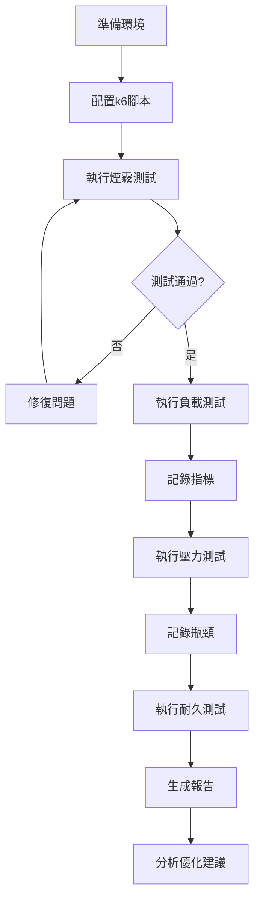

# MVP2 負載測試計劃

> **目的**: 驗證系統在生產環境下的性能表現和可用性
> **創建日期**: 2025-10-07
> **測試工具**: Grafana k6
> **目標**: 支持500+並發用戶，達成99.9%可用性

---

## 📊 測試目標

### 1. 並發用戶測試
- **目標**: 驗證系統支持500+並發用戶
- **測試級別**: 100 → 300 → 500 → 700 → 1000 用戶
- **成功標準**:
  - 響應時間 < 2秒 (P95)
  - 錯誤率 < 1%
  - CPU使用率 < 80%
  - 內存使用率 < 85%

### 2. 可用性測試
- **目標**: 確認99.9%可用性 (SLA)
- **測試時長**: 24小時持續負載
- **成功標準**:
  - 可用性 ≥ 99.9% (允許8.64秒停機/天)
  - 無嚴重錯誤或崩潰
  - 數據庫連接池穩定

### 3. 壓力測試
- **目標**: 找出系統極限和瓶頸
- **測試方法**: 逐步增加負載直至系統崩潰
- **監控指標**:
  - 系統最大吞吐量
  - 性能下降點
  - 資源瓶頸識別

---

## 🔧 測試工具選擇

### Grafana k6
**選擇理由**:
- ✅ 業界標準負載測試工具
- ✅ 支持複雜場景和JavaScript腳本
- ✅ 內建詳細性能指標
- ✅ 可與Grafana整合視覺化
- ✅ 支持CI/CD整合

**安裝**:
```bash
# Windows (Chocolatey)
choco install k6

# macOS (Homebrew)
brew install k6

# Linux (Debian/Ubuntu)
sudo gpg -k
sudo gpg --no-default-keyring --keyring /usr/share/keyrings/k6-archive-keyring.gpg --keyserver hkp://keyserver.ubuntu.com:80 --recv-keys C5AD17C747E3415A3642D57D77C6C491D6AC1D69
echo "deb [signed-by=/usr/share/keyrings/k6-archive-keyring.gpg] https://dl.k6.io/deb stable main" | sudo tee /etc/apt/sources.list.d/k6.list
sudo apt-get update
sudo apt-get install k6
```

---

## 📋 測試場景設計

### 場景1: 用戶登入和瀏覽 (70%流量)
```javascript
// 模擬用戶登入 → 瀏覽首頁 → 查看內容
export default function userBrowsing() {
  const loginRes = http.post('http://localhost:3005/api/auth/login', {
    email: 'test@example.com',
    password: 'password123'
  });
  check(loginRes, { 'login successful': (r) => r.status === 200 });

  const token = loginRes.json('accessToken');
  const params = { headers: { 'Authorization': `Bearer ${token}` } };

  http.get('http://localhost:3005/api/knowledge-base', params);
  sleep(randomIntBetween(2, 5));
}
```

### 場景2: 知識庫搜索 (20%流量)
```javascript
// 模擬知識庫搜索操作
export default function knowledgeSearch() {
  const searchRes = http.get(
    'http://localhost:3005/api/knowledge-base/search?query=產品',
    params
  );
  check(searchRes, { 'search successful': (r) => r.status === 200 });
  sleep(randomIntBetween(1, 3));
}
```

### 場景3: AI助理對話 (10%流量)
```javascript
// 模擬AI助理對話
export default function aiChat() {
  const chatRes = http.post(
    'http://localhost:3005/api/assistant/chat',
    { message: '幫我準備明天的會議' },
    params
  );
  check(chatRes, { 'chat successful': (r) => r.status === 200 });
  sleep(randomIntBetween(3, 6));
}
```

---

## 🎯 測試階段

### Phase 1: 煙霧測試 (Smoke Test)
**目標**: 驗證測試腳本和基本功能
- 虛擬用戶: 10
- 持續時間: 5分鐘
- 預期: 所有請求成功，無錯誤

### Phase 2: 負載測試 (Load Test)
**目標**: 測試不同負載級別
- Stage 1: 0 → 100用戶 (5分鐘 ramp-up)
- Stage 2: 100用戶穩定 (10分鐘)
- Stage 3: 100 → 300用戶 (5分鐘 ramp-up)
- Stage 4: 300用戶穩定 (10分鐘)
- Stage 5: 300 → 500用戶 (5分鐘 ramp-up)
- Stage 6: 500用戶穩定 (15分鐘)
- Stage 7: 500 → 0用戶 (5分鐘 ramp-down)

### Phase 3: 壓力測試 (Stress Test)
**目標**: 找出系統極限
- Stage 1: 0 → 700用戶 (10分鐘 ramp-up)
- Stage 2: 700用戶穩定 (10分鐘)
- Stage 3: 700 → 1000用戶 (5分鐘 ramp-up)
- Stage 4: 1000用戶穩定 (10分鐘)
- Stage 5: 持續增加直至系統崩潰

### Phase 4: 耐久測試 (Soak Test)
**目標**: 驗證24小時可用性
- 虛擬用戶: 300 (恆定)
- 持續時間: 24小時
- 監控: 內存洩漏、連接池耗盡、性能退化

---

## 📊 監控指標

### 應用層指標
- **請求成功率**: ≥ 99%
- **響應時間**: P50 < 500ms, P95 < 2s, P99 < 5s
- **錯誤率**: < 1%
- **每秒請求數 (RPS)**: ≥ 1000

### 系統層指標
- **CPU使用率**: < 80%
- **內存使用率**: < 85%
- **數據庫連接**: < 80%連接池
- **磁盤I/O**: < 70%容量

### 數據庫指標
- **查詢響應時間**: < 100ms (P95)
- **連接數**: < 最大連接數的80%
- **死鎖**: 0次
- **慢查詢**: < 5次/小時

---

## 🚨 失敗標準

任何以下情況視為測試失敗:
1. ❌ 錯誤率 > 1%
2. ❌ P95響應時間 > 2秒
3. ❌ 系統崩潰或服務不可用
4. ❌ 數據庫連接池耗盡
5. ❌ 內存洩漏導致OOM
6. ❌ CPU持續100%導致響應超時

---

## 📝 測試環境

### 硬件配置
- **CPU**: 4核心 (最低)
- **RAM**: 8GB (最低)
- **磁盤**: SSD
- **網絡**: 100Mbps+

### 軟件配置
- **Node.js**: v18+
- **PostgreSQL**: v14+ with pgvector
- **Next.js**: v14.2+
- **Redis**: v7+ (如有)

### 數據準備
- 預先插入測試數據:
  - 用戶: 1000個
  - 知識庫文章: 5000篇
  - 向量數據: 10000條
  - 會議記錄: 2000條

---

## 🔄 測試流程



---

## 📈 預期結果

### 目標達成標準
- ✅ 500並發用戶下，P95響應時間 < 2秒
- ✅ 99.9%可用性 (24小時測試)
- ✅ 系統可承受1000用戶峰值負載
- ✅ 無內存洩漏或資源耗盡
- ✅ 所有關鍵API端點響應時間達標

### 報告內容
1. 執行摘要
2. 測試環境詳細配置
3. 每個測試階段的詳細結果
4. 性能瓶頸分析
5. 資源使用趨勢圖
6. 優化建議列表
7. 風險評估

---

## 🛠️ 後續優化建議

根據測試結果，可能的優化方向:
1. 數據庫查詢優化 (索引、查詢計劃)
2. API響應緩存 (Redis)
3. 靜態資源CDN
4. 數據庫連接池調整
5. API限流和熔斷機制
6. 向量搜索性能優化
7. Azure OpenAI調用優化 (批次、緩存)

---

## 📅 時程規劃

| 階段 | 工作內容 | 預估時間 |
|-----|---------|---------|
| Day 1 | 安裝k6、編寫測試腳本、準備測試數據 | 1天 |
| Day 2 | 執行煙霧測試、負載測試、壓力測試 | 1天 |
| Day 3 | 啟動24小時耐久測試、分析結果、生成報告 | 1天 |
| **總計** | | **3天** |

---

## 🎯 下一步

1. ✅ 安裝k6負載測試工具
2. ✅ 編寫k6測試腳本
3. ✅ 準備測試數據庫和用戶
4. ✅ 執行煙霧測試驗證
5. ✅ 執行完整負載測試
6. ✅ 生成測試報告
7. ✅ 提出優化建議
