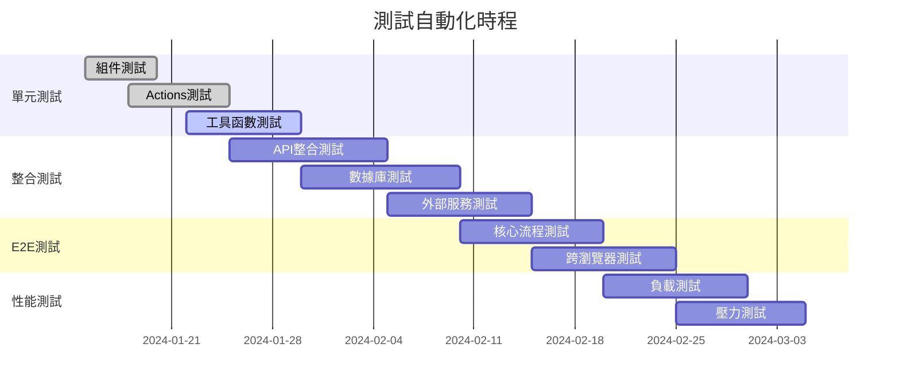

# 測試策略與計劃 - AI 銷售賦能平台

**版本**: 1.0.0
**日期**: 2024-01-09
**架構**: Next.js 14 全棧測試策略

---

## 📋 概述

本文檔定義了 AI 銷售賦能平台的完整測試策略，涵蓋從單元測試到用戶驗收測試的所有層級。基於 Next.js 14 全棧架構的特點，採用現代化的測試工具和最佳實踐。

### 測試金字塔

```
        🔺 E2E 測試 (5%)
          - 關鍵用戶流程
          - 瀏覽器自動化測試
       🔶 整合測試 (25%)
         - API 整合測試
         - 數據庫整合測試
      🔵 單元測試 (70%)
        - 組件測試
        - 函數測試
        - Server Actions 測試
```

### 測試目標

- **程式碼覆蓋率**: > 80% (單元測試)
- **功能覆蓋率**: > 90% (整合測試)
- **關鍵路徑**: 100% (E2E 測試)
- **性能測試**: 所有 API < 2 秒回應時間
- **安全測試**: 100% 敏感端點覆蓋

---

## 🛠️ 測試工具棧

### 前端測試

```json
{
  "devDependencies": {
    "jest": "^29.7.0",
    "@testing-library/react": "^14.1.2",
    "@testing-library/jest-dom": "^6.1.5",
    "@testing-library/user-event": "^14.5.1",
    "jest-environment-jsdom": "^29.7.0"
  }
}
```

### E2E 測試

```json
{
  "devDependencies": {
    "@playwright/test": "^1.40.0"
  }
}
```

### API 和整合測試

```json
{
  "devDependencies": {
    "supertest": "^6.3.3",
    "@testing-library/react-hooks": "^8.0.1",
    "msw": "^2.0.0"
  }
}
```

---

## 🧪 單元測試策略

### React 組件測試

#### 測試目標
- UI 組件正確渲染
- 用戶交互行為正確
- 狀態管理正常工作
- Props 傳遞正確

#### 範例：知識搜索組件測試

```typescript
// __tests__/components/KnowledgeSearch.test.tsx
import { render, screen, fireEvent, waitFor } from '@testing-library/react'
import userEvent from '@testing-library/user-event'
import { KnowledgeSearch } from '@/components/KnowledgeSearch'

// Mock tRPC
jest.mock('@/lib/trpc/client', () => ({
  trpc: {
    knowledge: {
      search: {
        useMutation: () => ({
          mutateAsync: jest.fn(),
          isLoading: false,
          data: null,
          error: null
        })
      }
    }
  }
}))

describe('KnowledgeSearch Component', () => {
  test('renders search input and button', () => {
    render(<KnowledgeSearch />)

    expect(screen.getByPlaceholderText('搜索知識庫...')).toBeInTheDocument()
    expect(screen.getByRole('button', { name: '搜索' })).toBeInTheDocument()
  })

  test('updates input value when typing', async () => {
    const user = userEvent.setup()
    render(<KnowledgeSearch />)

    const input = screen.getByPlaceholderText('搜索知識庫...')
    await user.type(input, 'Docuware 功能')

    expect(input).toHaveValue('Docuware 功能')
  })

  test('calls search API when button clicked', async () => {
    const mockMutateAsync = jest.fn()
    jest.mocked(trpc.knowledge.search.useMutation).mockReturnValue({
      mutateAsync: mockMutateAsync,
      isLoading: false,
      data: null,
      error: null
    })

    const user = userEvent.setup()
    render(<KnowledgeSearch />)

    await user.type(screen.getByPlaceholderText('搜索知識庫...'), 'test query')
    await user.click(screen.getByRole('button', { name: '搜索' }))

    expect(mockMutateAsync).toHaveBeenCalledWith({
      query: 'test query',
      limit: 10
    })
  })

  test('displays search results correctly', async () => {
    const mockResults = [
      {
        id: '1',
        title: '測試文檔',
        content: '這是測試內容',
        similarity: 0.95
      }
    ]

    jest.mocked(trpc.knowledge.search.useMutation).mockReturnValue({
      mutateAsync: jest.fn(),
      isLoading: false,
      data: { results: mockResults, totalCount: 1 },
      error: null
    })

    render(<KnowledgeSearch />)

    expect(screen.getByText('測試文檔')).toBeInTheDocument()
    expect(screen.getByText('這是測試內容')).toBeInTheDocument()
    expect(screen.getByText('相似度: 0.95')).toBeInTheDocument()
  })

  test('handles error states gracefully', async () => {
    jest.mocked(trpc.knowledge.search.useMutation).mockReturnValue({
      mutateAsync: jest.fn(),
      isLoading: false,
      data: null,
      error: new Error('搜索失敗')
    })

    render(<KnowledgeSearch />)

    expect(screen.getByText('搜索失敗')).toBeInTheDocument()
  })

  test('shows loading state during search', async () => {
    jest.mocked(trpc.knowledge.search.useMutation).mockReturnValue({
      mutateAsync: jest.fn(),
      isLoading: true,
      data: null,
      error: null
    })

    render(<KnowledgeSearch />)

    expect(screen.getByText('搜索中...')).toBeInTheDocument()
    expect(screen.getByRole('button', { name: '搜索' })).toBeDisabled()
  })
})
```

### Server Actions 測試

```typescript
// __tests__/actions/knowledge.test.ts
import { searchKnowledge } from '@/app/actions/knowledge'
import { getServerSession } from 'next-auth'
import prisma from '@/lib/prisma'

// Mock dependencies
jest.mock('next-auth')
jest.mock('@/lib/prisma')
jest.mock('@/lib/ai/embeddings')

const mockGetServerSession = getServerSession as jest.MockedFunction<typeof getServerSession>
const mockPrisma = prisma as jest.Mocked<typeof prisma>

describe('searchKnowledge Server Action', () => {
  beforeEach(() => {
    jest.clearAllMocks()
  })

  test('returns search results for authenticated user', async () => {
    // Mock authentication
    mockGetServerSession.mockResolvedValue({
      user: { id: '1', email: 'test@example.com' }
    })

    // Mock database query
    const mockResults = [
      {
        id: '1',
        title: 'Test Document',
        content: 'Test content',
        similarity: 0.9
      }
    ]
    mockPrisma.$queryRaw.mockResolvedValue(mockResults)

    const result = await searchKnowledge({
      query: 'test query',
      limit: 10
    })

    expect(result.results).toEqual(mockResults)
    expect(result.totalCount).toBe(1)
  })

  test('throws error for unauthenticated user', async () => {
    mockGetServerSession.mockResolvedValue(null)

    await expect(searchKnowledge({
      query: 'test query'
    })).rejects.toThrow('Unauthorized')
  })

  test('handles database errors gracefully', async () => {
    mockGetServerSession.mockResolvedValue({
      user: { id: '1', email: 'test@example.com' }
    })

    mockPrisma.$queryRaw.mockRejectedValue(new Error('Database error'))

    await expect(searchKnowledge({
      query: 'test query'
    })).rejects.toThrow('Database error')
  })
})
```

### 工具函數測試

```typescript
// __tests__/lib/utils.test.ts
import { formatCurrency, calculateSimilarity, validateEmail } from '@/lib/utils'

describe('Utility Functions', () => {
  describe('formatCurrency', () => {
    test('formats USD currency correctly', () => {
      expect(formatCurrency(1234.56, 'USD')).toBe('$1,234.56')
    })

    test('formats TWD currency correctly', () => {
      expect(formatCurrency(1234, 'TWD')).toBe('NT$1,234')
    })

    test('handles zero values', () => {
      expect(formatCurrency(0, 'USD')).toBe('$0.00')
    })
  })

  describe('calculateSimilarity', () => {
    test('calculates cosine similarity correctly', () => {
      const vector1 = [1, 0, 0]
      const vector2 = [1, 0, 0]
      expect(calculateSimilarity(vector1, vector2)).toBe(1)
    })

    test('returns 0 for orthogonal vectors', () => {
      const vector1 = [1, 0]
      const vector2 = [0, 1]
      expect(calculateSimilarity(vector1, vector2)).toBe(0)
    })
  })

  describe('validateEmail', () => {
    test('validates correct email format', () => {
      expect(validateEmail('user@example.com')).toBe(true)
      expect(validateEmail('test.email+tag@domain.co.uk')).toBe(true)
    })

    test('rejects invalid email format', () => {
      expect(validateEmail('invalid.email')).toBe(false)
      expect(validateEmail('user@')).toBe(false)
      expect(validateEmail('@domain.com')).toBe(false)
    })
  })
})
```

---

## 🔗 整合測試策略

### API 整合測試

#### 測試範圍
- Server Actions 與數據庫整合
- 外部服務整合（CRM、AI）
- 認證和授權流程
- 數據流完整性

#### 範例：CRM 整合測試

```typescript
// __tests__/integration/crm-integration.test.ts
import { syncCustomersFromCRM } from '@/app/actions/crm'
import { Dynamics365Client } from '@/lib/crm/dynamics365'
import prisma from '@/lib/prisma'

// Mock external dependencies
jest.mock('@/lib/crm/dynamics365')
jest.mock('next-auth')

describe('CRM Integration', () => {
  beforeEach(async () => {
    // 清空測試數據
    await prisma.customer.deleteMany()
  })

  afterAll(async () => {
    await prisma.$disconnect()
  })

  test('syncs customers from Dynamics 365 successfully', async () => {
    // Mock CRM data
    const mockCrmCustomers = [
      {
        accountid: 'crm-123',
        name: 'Test Company',
        emailaddress1: 'contact@testcompany.com',
        telephone1: '123-456-7890',
        industrycode: 'Technology'
      }
    ]

    jest.mocked(Dynamics365Client.prototype.getAccounts)
        .mockResolvedValue(mockCrmCustomers)

    // Mock authenticated user
    jest.mocked(getServerSession).mockResolvedValue({
      user: { id: '1', role: 'ADMIN' }
    })

    const result = await syncCustomersFromCRM()

    expect(result.success).toBe(true)
    expect(result.syncedCount).toBe(1)

    // Verify customer was created in database
    const customer = await prisma.customer.findFirst({
      where: { crm_id: 'crm-123' }
    })

    expect(customer).not.toBeNull()
    expect(customer?.company_name).toBe('Test Company')
    expect(customer?.email).toBe('contact@testcompany.com')
  })

  test('handles CRM API failures gracefully', async () => {
    jest.mocked(Dynamics365Client.prototype.getAccounts)
        .mockRejectedValue(new Error('CRM API Error'))

    jest.mocked(getServerSession).mockResolvedValue({
      user: { id: '1', role: 'ADMIN' }
    })

    const result = await syncCustomersFromCRM()

    expect(result.success).toBe(false)
    expect(result.error).toContain('Sync failed')
  })

  test('requires admin permissions', async () => {
    jest.mocked(getServerSession).mockResolvedValue({
      user: { id: '1', role: 'SALES_REP' }
    })

    const result = await syncCustomersFromCRM()

    expect(result.success).toBe(false)
    expect(result.error).toBe('Insufficient permissions')
  })
})
```

### 數據庫整合測試

```typescript
// __tests__/integration/database.test.ts
import prisma from '@/lib/prisma'

describe('Database Integration', () => {
  beforeEach(async () => {
    // 設置測試數據
    await prisma.user.create({
      data: {
        email: 'test@example.com',
        password_hash: 'hashed_password',
        first_name: 'Test',
        last_name: 'User',
        role: 'SALES_REP'
      }
    })
  })

  afterEach(async () => {
    // 清理測試數據
    await prisma.user.deleteMany()
    await prisma.customer.deleteMany()
  })

  test('creates customer with relationships', async () => {
    const user = await prisma.user.findFirst()

    const customer = await prisma.customer.create({
      data: {
        company_name: 'Test Company',
        email: 'test@company.com',
        status: 'PROSPECT',
        assigned_user_id: user!.id
      }
    })

    // Test relationship
    const customerWithUser = await prisma.customer.findUnique({
      where: { id: customer.id },
      include: { assignedUser: true }
    })

    expect(customerWithUser?.assignedUser?.first_name).toBe('Test')
  })

  test('vector search works correctly', async () => {
    // Insert test document with embedding
    await prisma.document.create({
      data: {
        title: 'Test Document',
        content: 'This is test content about Docuware',
        category: 'OTHER',
        embedding: [0.1, 0.2, 0.3, ...] // mock vector
      }
    })

    // Test vector search query
    const results = await prisma.$queryRaw`
      SELECT title, content, 1 - (embedding <=> ${'[0.1, 0.2, 0.3, ...]'}::vector) as similarity
      FROM documents
      WHERE 1 - (embedding <=> ${'[0.1, 0.2, 0.3, ...]'}::vector) > 0.8
      ORDER BY similarity DESC
      LIMIT 5
    `

    expect(results).toHaveLength(1)
  })
})
```

---

## 🎭 End-to-End 測試策略

### Playwright 配置

```typescript
// playwright.config.ts
import { defineConfig, devices } from '@playwright/test'

export default defineConfig({
  testDir: './e2e',
  fullyParallel: true,
  forbidOnly: !!process.env.CI,
  retries: process.env.CI ? 2 : 0,
  workers: process.env.CI ? 1 : undefined,
  reporter: 'html',

  use: {
    baseURL: 'http://localhost:3000',
    trace: 'on-first-retry',
    screenshot: 'only-on-failure',
  },

  projects: [
    {
      name: 'chromium',
      use: { ...devices['Desktop Chrome'] },
    },
    {
      name: 'firefox',
      use: { ...devices['Desktop Firefox'] },
    },
    {
      name: 'webkit',
      use: { ...devices['Desktop Safari'] },
    },
    {
      name: 'Mobile Chrome',
      use: { ...devices['Pixel 5'] },
    },
  ],

  webServer: {
    command: 'npm run dev',
    url: 'http://localhost:3000',
    reuseExistingServer: !process.env.CI,
  },
})
```

### 關鍵用戶流程測試

#### 1. 完整搜索流程

```typescript
// e2e/knowledge-search.spec.ts
import { test, expect } from '@playwright/test'

test.describe('Knowledge Search Flow', () => {
  test.beforeEach(async ({ page }) => {
    // Login as test user
    await page.goto('/login')
    await page.fill('[data-testid=email-input]', 'test@example.com')
    await page.fill('[data-testid=password-input]', 'password123')
    await page.click('[data-testid=login-button]')
    await expect(page).toHaveURL('/dashboard')
  })

  test('complete search workflow', async ({ page }) => {
    // Navigate to search
    await page.click('[data-testid=search-nav]')
    await expect(page).toHaveURL('/search')

    // Perform search
    await page.fill('[data-testid=search-input]', 'Docuware 功能')
    await page.click('[data-testid=search-button]')

    // Verify results
    await expect(page.locator('[data-testid=search-results]')).toBeVisible()
    await expect(page.locator('[data-testid=result-item]')).toHaveCount.greaterThan(0)

    // Click on first result
    await page.click('[data-testid=result-item]:first-child')
    await expect(page.locator('[data-testid=document-content]')).toBeVisible()

    // Verify document actions
    await expect(page.locator('[data-testid=bookmark-button]')).toBeVisible()
    await expect(page.locator('[data-testid=share-button]')).toBeVisible()
  })

  test('search with filters', async ({ page }) => {
    await page.goto('/search')

    // Apply category filter
    await page.click('[data-testid=category-filter]')
    await page.click('[data-testid=category-proposal]')

    // Apply date range
    await page.fill('[data-testid=date-from]', '2024-01-01')
    await page.fill('[data-testid=date-to]', '2024-12-31')

    // Search
    await page.fill('[data-testid=search-input]', '提案')
    await page.click('[data-testid=search-button]')

    // Verify filtered results
    await expect(page.locator('[data-testid=result-category]:first-child')).toHaveText('提案')
  })
})
```

#### 2. CRM 整合和客戶管理

```typescript
// e2e/customer-management.spec.ts
import { test, expect } from '@playwright/test'

test.describe('Customer Management', () => {
  test.beforeEach(async ({ page }) => {
    await page.goto('/login')
    await page.fill('[data-testid=email-input]', 'admin@example.com')
    await page.fill('[data-testid=password-input]', 'admin123')
    await page.click('[data-testid=login-button]')
  })

  test('sync customers from CRM', async ({ page }) => {
    await page.goto('/customers')

    // Trigger CRM sync
    await page.click('[data-testid=sync-crm-button]')

    // Wait for sync completion
    await expect(page.locator('[data-testid=sync-success-message]')).toBeVisible()

    // Verify customers loaded
    await expect(page.locator('[data-testid=customer-list]')).toBeVisible()
    await expect(page.locator('[data-testid=customer-item]')).toHaveCount.greaterThan(0)
  })

  test('view customer 360 view', async ({ page }) => {
    await page.goto('/customers')

    // Click on first customer
    await page.click('[data-testid=customer-item]:first-child')

    // Verify 360 view components
    await expect(page.locator('[data-testid=customer-profile]')).toBeVisible()
    await expect(page.locator('[data-testid=call-history]')).toBeVisible()
    await expect(page.locator('[data-testid=proposal-history]')).toBeVisible()
    await expect(page.locator('[data-testid=ai-insights]')).toBeVisible()

    // Test AI insights
    const insightScore = await page.locator('[data-testid=opportunity-score]').textContent()
    expect(parseFloat(insightScore!)).toBeGreaterThan(0)
  })
})
```

#### 3. AI 提案生成流程

```typescript
// e2e/proposal-generation.spec.ts
import { test, expect } from '@playwright/test'

test.describe('Proposal Generation', () => {
  test('generate AI proposal end-to-end', async ({ page }) => {
    await page.goto('/login')
    await page.fill('[data-testid=email-input]', 'sales@example.com')
    await page.fill('[data-testid=password-input]', 'sales123')
    await page.click('[data-testid=login-button]')

    // Navigate to proposal creation
    await page.goto('/proposals/new')

    // Select customer
    await page.click('[data-testid=customer-select]')
    await page.click('[data-testid=customer-option]:first-child')

    // Enter requirements
    await page.fill('[data-testid=requirements-input]',
      '客戶需要一個完整的文檔管理解決方案，包含自動化工作流程和權限管理')

    // Select template
    await page.click('[data-testid=template-select]')
    await page.click('[data-testid=template-docuware]')

    // Generate proposal
    await page.click('[data-testid=generate-button]')

    // Wait for AI generation
    await expect(page.locator('[data-testid=generation-progress]')).toBeVisible()
    await expect(page.locator('[data-testid=proposal-content]')).toBeVisible({ timeout: 30000 })

    // Verify generated content
    const proposalContent = await page.locator('[data-testid=proposal-content]').textContent()
    expect(proposalContent).toContain('文檔管理')
    expect(proposalContent).toContain('解決方案')

    // Edit and save
    await page.click('[data-testid=edit-button]')
    await page.fill('[data-testid=title-input]', '定制文檔管理解決方案提案')
    await page.click('[data-testid=save-button]')

    // Verify save success
    await expect(page.locator('[data-testid=save-success-message]')).toBeVisible()
  })
})
```

---

## ⚡ 性能測試

### 負載測試

```typescript
// performance/load-test.js
import http from 'k6/http'
import { check, sleep } from 'k6'

export let options = {
  stages: [
    { duration: '5m', target: 50 }, // 漸增到50用戶
    { duration: '10m', target: 50 }, // 維持50用戶
    { duration: '5m', target: 100 }, // 漸增到100用戶
    { duration: '10m', target: 100 }, // 維持100用戶
    { duration: '5m', target: 0 }, // 漸減到0
  ],
  thresholds: {
    http_req_duration: ['p(95)<2000'], // 95%請求<2秒
    http_req_failed: ['rate<0.1'], // 錯誤率<10%
  }
}

export default function () {
  // 測試搜索 API
  let response = http.post('http://localhost:3000/api/trpc/knowledge.search', {
    query: 'Docuware 功能',
    limit: 10
  })

  check(response, {
    'status is 200': (r) => r.status === 200,
    'response time < 2000ms': (r) => r.timings.duration < 2000,
  })

  sleep(1)
}
```

### 數據庫性能測試

```sql
-- performance/database-benchmarks.sql

-- 測試向量搜索性能
EXPLAIN ANALYZE
SELECT id, title, content, 1 - (embedding <=> '[...]'::vector) as similarity
FROM knowledge_base
WHERE 1 - (embedding <=> '[...]'::vector) > 0.7
ORDER BY similarity DESC
LIMIT 10;

-- 測試複雜客戶查詢性能
EXPLAIN ANALYZE
SELECT c.*, COUNT(cr.id) as call_count, COUNT(p.id) as proposal_count
FROM customers c
LEFT JOIN call_records cr ON c.id = cr.customer_id
LEFT JOIN proposals p ON c.id = p.customer_id
WHERE c.status IN ('PROSPECT', 'QUALIFIED')
  AND c.created_at >= NOW() - INTERVAL '6 months'
GROUP BY c.id
ORDER BY call_count DESC, proposal_count DESC
LIMIT 50;
```

---

## 🔒 安全測試

### 認證和授權測試

```typescript
// __tests__/security/auth.test.ts
import { NextRequest } from 'next/server'
import { middleware } from '@/middleware'

describe('Authentication Security', () => {
  test('blocks unauthenticated access to protected routes', async () => {
    const request = new NextRequest('http://localhost:3000/dashboard')
    const response = await middleware(request)

    expect(response?.status).toBe(302) // Redirect to login
  })

  test('allows access with valid session', async () => {
    const request = new NextRequest('http://localhost:3000/dashboard', {
      headers: {
        cookie: 'next-auth.session-token=valid-session-token'
      }
    })

    // Mock session validation
    jest.mock('next-auth/jwt', () => ({
      getToken: () => ({ userId: '1', role: 'SALES_REP' })
    }))

    const response = await middleware(request)
    expect(response).toBeUndefined() // No redirect, access allowed
  })

  test('enforces role-based access control', async () => {
    // Test admin-only route with sales rep user
    const request = new NextRequest('http://localhost:3000/admin', {
      headers: {
        cookie: 'next-auth.session-token=sales-rep-token'
      }
    })

    const response = await middleware(request)
    expect(response?.status).toBe(403) // Forbidden
  })
})
```

### SQL 注入測試

```typescript
// __tests__/security/sql-injection.test.ts
import { searchKnowledge } from '@/app/actions/knowledge'

describe('SQL Injection Prevention', () => {
  test('handles malicious search query safely', async () => {
    const maliciousQuery = "'; DROP TABLE knowledge_base; --"

    // Mock authenticated session
    jest.mocked(getServerSession).mockResolvedValue({
      user: { id: '1', role: 'SALES_REP' }
    })

    // Should not throw SQL error
    await expect(searchKnowledge({
      query: maliciousQuery
    })).resolves.toBeDefined()

    // Verify database is still intact
    const count = await prisma.knowledgeBase.count()
    expect(count).toBeGreaterThan(0)
  })
})
```

---

## 📊 測試報告與監控

### 覆蓋率報告配置

```json
// jest.config.js
{
  "collectCoverageFrom": [
    "app/**/*.{ts,tsx}",
    "components/**/*.{ts,tsx}",
    "lib/**/*.{ts,tsx}",
    "!**/*.d.ts",
    "!**/node_modules/**"
  ],
  "coverageReporters": ["html", "lcov", "text"],
  "coverageThreshold": {
    "global": {
      "branches": 80,
      "functions": 80,
      "lines": 80,
      "statements": 80
    }
  }
}
```

### CI/CD 測試流程

```yaml
# .github/workflows/test.yml
name: Test Suite

on:
  push:
    branches: [ main, develop ]
  pull_request:
    branches: [ main ]

jobs:
  test:
    runs-on: ubuntu-latest

    services:
      postgres:
        image: pgvector/pgvector:pg16
        env:
          POSTGRES_PASSWORD: postgres
        options: >-
          --health-cmd pg_isready
          --health-interval 10s
          --health-timeout 5s
          --health-retries 5

    steps:
    - uses: actions/checkout@v4

    - name: Setup Node.js
      uses: actions/setup-node@v4
      with:
        node-version: '18'
        cache: 'npm'

    - name: Install dependencies
      run: npm ci

    - name: Run unit tests
      run: npm run test:unit

    - name: Run integration tests
      run: npm run test:integration

    - name: Run E2E tests
      run: npm run test:e2e

    - name: Generate coverage report
      run: npm run test:coverage

    - name: Upload coverage to Codecov
      uses: codecov/codecov-action@v3
```

### 測試監控儀表板

```typescript
// scripts/test-dashboard.ts
import fs from 'fs'
import path from 'path'

type TestMetrics = {
  unitTests: {
    total: number
    passed: number
    failed: number
    coverage: number
  }
  integrationTests: {
    total: number
    passed: number
    duration: number
  }
  e2eTests: {
    total: number
    passed: number
    avgDuration: number
  }
}

export function generateTestReport(metrics: TestMetrics) {
  const report = `
# 測試執行報告

## 單元測試
- 總測試數: ${metrics.unitTests.total}
- 通過: ${metrics.unitTests.passed}
- 失敗: ${metrics.unitTests.failed}
- 覆蓋率: ${metrics.unitTests.coverage}%

## 整合測試
- 總測試數: ${metrics.integrationTests.total}
- 通過: ${metrics.integrationTests.passed}
- 執行時間: ${metrics.integrationTests.duration}ms

## E2E 測試
- 總測試數: ${metrics.e2eTests.total}
- 通過: ${metrics.e2eTests.passed}
- 平均執行時間: ${metrics.e2eTests.avgDuration}ms

生成時間: ${new Date().toISOString()}
`

  fs.writeFileSync(path.join(process.cwd(), 'test-report.md'), report)
}
```

---

## 🎯 測試執行計劃

### MVP Phase 1 測試重點

#### Sprint 1-2: 基礎功能測試
- ✅ 用戶認證系統測試
- ✅ 知識庫搜索功能測試
- ✅ 數據庫整合測試
- ✅ 基本 E2E 流程測試

#### Sprint 3-4: 整合功能測試
- ✅ CRM 整合測試
- ✅ AI 提案生成測試
- ✅ 性能基準測試
- ✅ 安全漏洞掃描

### 測試自動化時程



---

## ✅ 測試檢查清單

### 發布前必須通過的測試

#### 功能測試
- [ ] 所有單元測試通過 (>80% 覆蓋率)
- [ ] 整合測試通過 (>90% API 覆蓋率)
- [ ] 關鍵 E2E 測試通過 (100% 核心流程)
- [ ] 跨瀏覽器相容性測試

#### 性能測試
- [ ] API 回應時間 < 2 秒 (95% 請求)
- [ ] 頁面載入時間 < 3 秒
- [ ] 向量搜索 < 500ms
- [ ] 並發用戶負載測試通過

#### 安全測試
- [ ] 認證授權測試通過
- [ ] SQL 注入防護測試
- [ ] XSS 防護測試
- [ ] CSRF 防護測試
- [ ] 敏感資料加密檢查

#### 相容性測試
- [ ] Chrome (桌面/手機)
- [ ] Firefox (桌面)
- [ ] Safari (桌面/手機)
- [ ] Edge (桌面)

---

*本測試策略文檔將隨著專案開發進度持續更新和完善，確保測試覆蓋率和品質標準。*